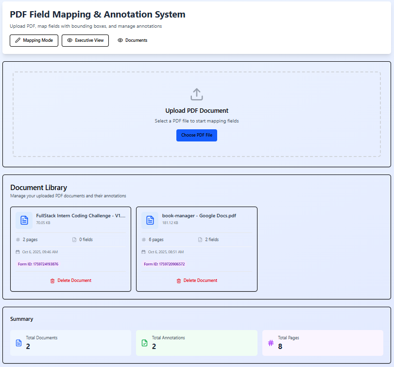

# PDF Field Mapping and Annotation Management System



A comprehensive React-based solution for mapping and annotating PDF form fields with bounding boxes, saving metadata to a database, and reviewing annotations.

## Table of Contents
- [Project Overview](#project-overview)
- [Features](#features)
- [Technology Stack](#technology-stack)
- [Installation and Setup](#installation-and-setup)
- [Usage](#usage)
- [API Endpoints](#api-endpoints)
- [Project Structure](#project-structure)
- [Contributing](#contributing)
- [License](#license)

## Project Overview

This system enables users to upload PDF documents, interactively map form fields by drawing bounding boxes around them, and save these mappings with associated metadata to a database. The system also provides a review mode to validate and manage existing annotations.

The application consists of two main workflows:
1. **Mapping Mode**: Upload PDF, draw annotations, and save field mappings
2. **Executive/Review Mode**: Fetch saved mappings, populate forms, and highlight annotated regions

## Features

### Core Functionality
- **PDF Upload**: Secure file upload with document ID tracking
- **Interactive Field Mapping**: Draw bounding boxes on PDF pages to define form fields
- **Metadata Configuration**: Assign field names, headers, types, validation rules, and other properties
- **Coordinate System**: Support for both pixel and normalized coordinates
- **Zoom Controls**: Zoom in/out functionality for precise annotation
- **Page Navigation**: Easy navigation through multi-page PDFs
- **Annotation Management**: Create, edit, delete, and save annotations
- **Visual Validation**: Highlight annotations when fields are selected in review mode

### Technical Features
- **Responsive Design**: Works on desktop and tablet devices
- **Error Handling**: Comprehensive error handling with user-friendly notifications
- **Performance Optimized**: Efficient rendering and state management
- **Data Persistence**: Save annotations to database with bulk operations
- **Real-time Feedback**: Visual feedback during annotation creation and editing

## Technology Stack

### Frontend
- **React 18+**: UI library with modern hooks and features
- **PDF.js**: PDF rendering and manipulation
- **Tailwind CSS**: Utility-first CSS framework
- **Lucide React**: Icon library
- **React Hot Toast**: Toast notifications
- **Axios**: HTTP client for API requests

### Backend
- **Node.js**: Runtime environment (implied from project structure)
- **Express.js**: Web framework (implied from project structure)
- **Database**: (Type depends on your backend implementation)

## Installation and Setup

### Prerequisites
- Node.js (v14 or higher)
- npm or yarn

### Clone the Repository
```bash
git clone <repository-url>
cd pdf-annotation-system
```

### Install Dependencies
```bash
npm install
# or
yarn install
```

### Environment Configuration
Create a `.env` file in the root directory with the following variables:
```env
API_BASE_URL=http://localhost:5000/api
```

### Start the Development Server
```bash
npm start
# or
yarn start
```

The application will be available at `http://localhost:3000`.

### Build for Production
```bash
npm run build
# or
yarn build
```

## Usage

### 1. Uploading a PDF
1. Click the "Upload" button in the header
2. Select a PDF file from your device
3. The system will process the PDF and convert pages to images
4. A document ID will be generated for tracking

### 2. Mapping Fields
1. After upload, switch to "Map Fields" mode
2. Navigate through pages using the Previous/Next buttons
3. Draw bounding boxes around form fields by clicking and dragging
4. Configure field metadata in the form panel:
   - Field Name (required)
   - Field Header
   - Field Type (CharField, DateField, etc.)
   - Placeholder text
   - Max length
   - Required field toggle
5. Click "Save Field Annotation" to add the field
6. Repeat for all fields on all pages
7. Click "Save All Annotations" to persist to the database

### 3. Reviewing Annotations
1. Switch to "Review" mode
2. View all mapped fields in the left panel
3. Click on any field to:
   - Navigate to the corresponding PDF page
   - Highlight the field's bounding box
4. Use zoom controls to inspect annotations closely
5. Edit or delete annotations as needed

## API Endpoints

### PDF Upload
- **POST** `/api/upload-pdf`
  - Uploads a PDF file and returns a document ID
  - Parameters: `pdf` (file), `process_id`, `form_id`

### Annotation Management
- **POST** `/api/pdf-annotation-mappings/bulk/`
  - Saves multiple annotations to the database
  - Parameters: Array of annotation objects

- **POST** `/app_admin/api/fetch-create-table/`
  - Retrieves saved annotations and metadata
  - Parameters: `process_id`, `form_id`

- **PUT** `/api/pdf-annotation-mappings/{id}`
  - Updates an existing annotation
  - Parameters: Annotation object

- **DELETE** `/api/pdf-annotation-mappings/{id}`
  - Deletes an annotation
  - Parameters: Annotation ID

### Sample Annotation Payload
```json
{
  "process": 49,
  "form_id": 20,
  "field_id": 125,
  "field_name": "Bar_Code",
  "field_header": "Enter barcode",
  "bbox": [100, 250, 300, 300],
  "page": 1,
  "scale": 1.5,
  "field_type": "CharField",
  "metadata": {
    "required": true,
    "max_length": 50
  }
}
```

### Sample Response for Fetching Annotations
```json
[
  {
    "id": 124,
    "annotation": {
      "bbox": {
        "x1": 0.1757,
        "x2": 0.2654,
        "y1": 0.0139,
        "y2": 0.0159
      },
      "page": 1,
      "field_id": 124,
      "field_name": "Application_Date",
      "field_header": "Account Details",
      "process": 49,
      "form_id": 20
    },
    "table_name": "table_49_qc",
    "field_name": "Application_Date",
    "field_type": "DateField",
    "max_length": 0,
    "relation_type": "",
    "related_table_name": "",
    "related_field": "",
    "group": 1,
    "field_header": "Account Details",
    "placeholder": "Application Date",
    "required": false,
    "field_options": "[]",
    "types": "date",
    "validation_code": null,
    "required_if": null,
    "regex_ptn": null,
    "form_id": 20,
    "process_id": "49"
  }
]
```

## Project Structure

```
pdf-annotation-system/
├── public/                 # Static assets
├── src/
│   ├── components/         # React components
│   │   ├── PDFAnnotationSystem.jsx
│   │   └── Toaster.jsx
│   ├── helpers/            # Utility functions
│   │   ├── api.js          # API service functions
│   │   ├── config.js       # Configuration constants
│   │   └── pdfRenderer.js  # PDF rendering utilities
│   ├── App.jsx             # Main App component
│   ├── index.jsx           # Entry point
│   └── index.css           # Global styles
├── .env                    # Environment variables
├── .gitignore              # Git ignore rules
├── package.json            # Dependencies and scripts
└── README.md               # This file
```

### Component Descriptions

- **PDFAnnotationSystem**: Main component managing application state and modes
- **PDFCanvas**: Handles PDF rendering and annotation drawing
- **PDFUploader**: File upload interface
- **AnnotationForm**: Form for configuring field metadata
- **AnnotationList**: Displays list of annotations with edit/delete options
- **GenericModal**: Reusable modal component
- **Toaster**: Toast notification container

## Contributing

We welcome contributions to improve this project! Please follow these steps:

1. Fork the repository
2. Create a new branch (`git checkout -b feature/amazing-feature`)
3. Commit your changes (`git commit -m 'Add amazing feature'`)
4. Push to the branch (`git push origin feature/amazing-feature`)
5. Open a Pull Request

### Development Guidelines
- Follow the existing code style and structure
- Add appropriate comments for complex logic
- Ensure all features work across supported browsers
- Write clear, descriptive commit messages
- Update documentation as needed

## License

This project is licensed under the MIT License - see the [LICENSE](LICENSE) file for details.

## Support

For support, please open an issue in the GitHub repository or contact the development team.

---

**Note**: This README assumes a backend API is already implemented to support the endpoints described. The frontend code is designed to work with a Node.js/Express backend, but can be adapted to work with other backend technologies.
